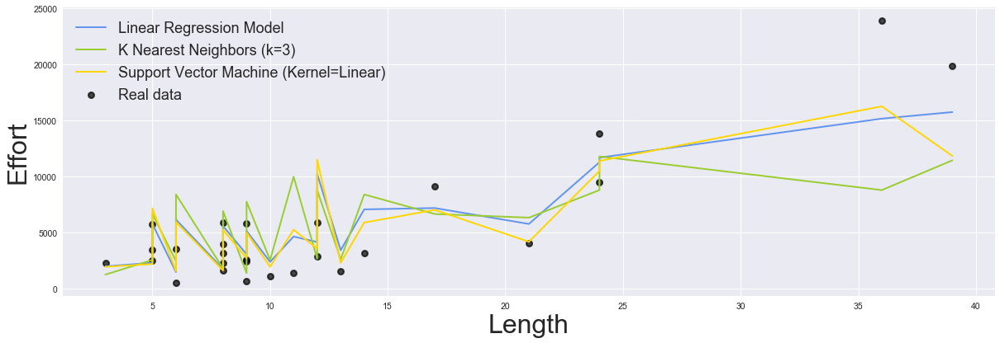
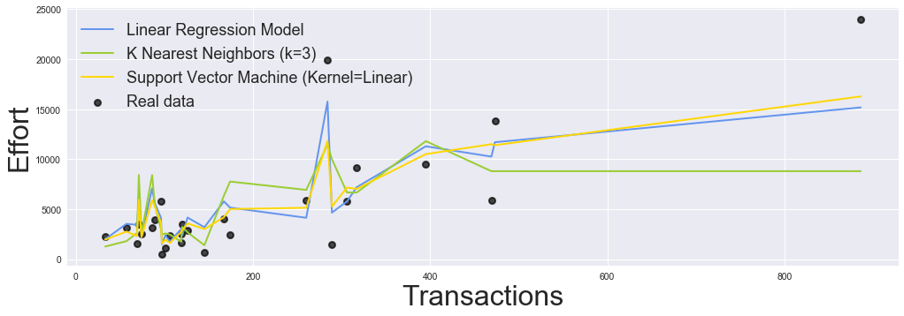
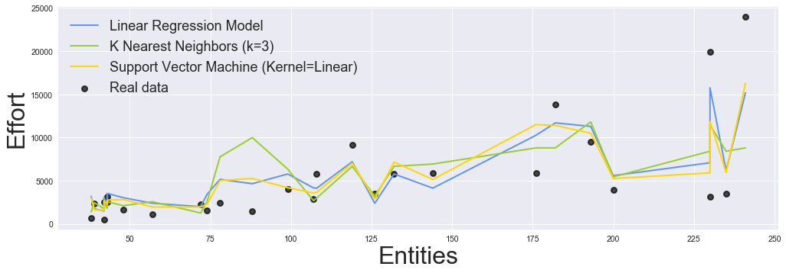

### This is a PROMISE Software Engineering Repository data set made publicly available in order to encourage repeatable, verifiable, refutable, and/or improvable predictive models of software engineering.

If you publish material based on PROMISE data sets then, please
follow the acknowledgment guidelines posted on the PROMISE repository
web page http://promise.site.uottawa.ca/SERepository .

## _Abstract_

_Making decisions with a highly uncertain level is a critical problem
in the area of software engineering. Predicting software quality requires high
accurate tools and high-level experience. Otherwise, AI-based predictive models
could be a useful tool with an accurate degree that helps on the prediction
of software effort based on historical data from software development metrics.
In this study, we built a software effort estimation model to predict this effort
using a linear regression model. This statistical model was developed using a
non-parametric linear regression algorithm based on the K-Nearest Neighbours
(KNN). So, our results show the possibility of using AI methods to predict the
software engineering effort prediction problem with an coefficient of determination
of 76%_


```python
import math
from scipy.io import arff
from scipy.stats.stats import pearsonr
from sklearn.model_selection import cross_val_score
import pandas as pd
import numpy as np

from sklearn.linear_model import LinearRegression
from sklearn.neighbors import KNeighborsRegressor
from sklearn.model_selection import GridSearchCV
from sklearn.svm import SVR
from sklearn.cross_validation import train_test_split

# Formatação mais bonita para os notebooks
import seaborn as sns
import matplotlib.pyplot as plt

%matplotlib inline
plt.style.use('fivethirtyeight')
plt.rcParams['figure.figsize'] = (15,5)

```


```python
df_desharnais = pd.read_csv('../Datasets/02.desharnais.csv',  header=0)
df_desharnais.head()
```


<div>
<style scoped>
    .dataframe tbody tr th:only-of-type {
        vertical-align: middle;
    }

    .dataframe tbody tr th {
        vertical-align: top;
    }

    .dataframe thead th {
        text-align: right;
    }
</style>
<table border="1" class="dataframe">
  <thead>
    <tr style="text-align: right;">
      <th></th>
      <th>id</th>
      <th>Project</th>
      <th>TeamExp</th>
      <th>ManagerExp</th>
      <th>YearEnd</th>
      <th>Length</th>
      <th>Effort</th>
      <th>Transactions</th>
      <th>Entities</th>
      <th>PointsNonAdjust</th>
      <th>Adjustment</th>
      <th>PointsAjust</th>
      <th>Language</th>
    </tr>
  </thead>
  <tbody>
    <tr>
      <th>0</th>
      <td>1</td>
      <td>1</td>
      <td>1</td>
      <td>4</td>
      <td>85</td>
      <td>12</td>
      <td>5152</td>
      <td>253</td>
      <td>52</td>
      <td>305</td>
      <td>34</td>
      <td>302</td>
      <td>1</td>
    </tr>
    <tr>
      <th>1</th>
      <td>2</td>
      <td>2</td>
      <td>0</td>
      <td>0</td>
      <td>86</td>
      <td>4</td>
      <td>5635</td>
      <td>197</td>
      <td>124</td>
      <td>321</td>
      <td>33</td>
      <td>315</td>
      <td>1</td>
    </tr>
    <tr>
      <th>2</th>
      <td>3</td>
      <td>3</td>
      <td>4</td>
      <td>4</td>
      <td>85</td>
      <td>1</td>
      <td>805</td>
      <td>40</td>
      <td>60</td>
      <td>100</td>
      <td>18</td>
      <td>83</td>
      <td>1</td>
    </tr>
    <tr>
      <th>3</th>
      <td>4</td>
      <td>4</td>
      <td>0</td>
      <td>0</td>
      <td>86</td>
      <td>5</td>
      <td>3829</td>
      <td>200</td>
      <td>119</td>
      <td>319</td>
      <td>30</td>
      <td>303</td>
      <td>1</td>
    </tr>
    <tr>
      <th>4</th>
      <td>5</td>
      <td>5</td>
      <td>0</td>
      <td>0</td>
      <td>86</td>
      <td>4</td>
      <td>2149</td>
      <td>140</td>
      <td>94</td>
      <td>234</td>
      <td>24</td>
      <td>208</td>
      <td>1</td>
    </tr>
  </tbody>
</table>
</div>


```python
df_desharnais.info()
```

    <class 'pandas.core.frame.DataFrame'>
    RangeIndex: 81 entries, 0 to 80
    Data columns (total 13 columns):
    id                 81 non-null int64
    Project            81 non-null int64
    TeamExp            81 non-null int64
    ManagerExp         81 non-null int64
    YearEnd            81 non-null int64
    Length             81 non-null int64
    Effort             81 non-null int64
    Transactions       81 non-null int64
    Entities           81 non-null int64
    PointsNonAdjust    81 non-null int64
    Adjustment         81 non-null int64
    PointsAjust        81 non-null int64
    Language           81 non-null int64
    dtypes: int64(13)
    memory usage: 8.3 KB


```python
df_desharnais.describe()
```


<div>
<style scoped>
    .dataframe tbody tr th:only-of-type {
        vertical-align: middle;
    }

    .dataframe tbody tr th {
        vertical-align: top;
    }

    .dataframe thead th {
        text-align: right;
    }
</style>
<table border="1" class="dataframe">
  <thead>
    <tr style="text-align: right;">
      <th></th>
      <th>id</th>
      <th>Project</th>
      <th>TeamExp</th>
      <th>ManagerExp</th>
      <th>YearEnd</th>
      <th>Length</th>
      <th>Effort</th>
      <th>Transactions</th>
      <th>Entities</th>
      <th>PointsNonAdjust</th>
      <th>Adjustment</th>
      <th>PointsAjust</th>
      <th>Language</th>
    </tr>
  </thead>
  <tbody>
    <tr>
      <th>count</th>
      <td>81.000000</td>
      <td>81.000000</td>
      <td>81.000000</td>
      <td>81.000000</td>
      <td>81.000000</td>
      <td>81.000000</td>
      <td>81.000000</td>
      <td>81.000000</td>
      <td>81.000000</td>
      <td>81.000000</td>
      <td>81.000000</td>
      <td>81.000000</td>
      <td>81.000000</td>
    </tr>
    <tr>
      <th>mean</th>
      <td>41.000000</td>
      <td>41.000000</td>
      <td>2.185185</td>
      <td>2.530864</td>
      <td>85.740741</td>
      <td>11.666667</td>
      <td>5046.308642</td>
      <td>182.123457</td>
      <td>122.333333</td>
      <td>304.456790</td>
      <td>27.629630</td>
      <td>289.234568</td>
      <td>1.555556</td>
    </tr>
    <tr>
      <th>std</th>
      <td>23.526581</td>
      <td>23.526581</td>
      <td>1.415195</td>
      <td>1.643825</td>
      <td>1.222475</td>
      <td>7.424621</td>
      <td>4418.767228</td>
      <td>144.035098</td>
      <td>84.882124</td>
      <td>180.210159</td>
      <td>10.591795</td>
      <td>185.761088</td>
      <td>0.707107</td>
    </tr>
    <tr>
      <th>min</th>
      <td>1.000000</td>
      <td>1.000000</td>
      <td>-1.000000</td>
      <td>-1.000000</td>
      <td>82.000000</td>
      <td>1.000000</td>
      <td>546.000000</td>
      <td>9.000000</td>
      <td>7.000000</td>
      <td>73.000000</td>
      <td>5.000000</td>
      <td>62.000000</td>
      <td>1.000000</td>
    </tr>
    <tr>
      <th>25%</th>
      <td>21.000000</td>
      <td>21.000000</td>
      <td>1.000000</td>
      <td>1.000000</td>
      <td>85.000000</td>
      <td>6.000000</td>
      <td>2352.000000</td>
      <td>88.000000</td>
      <td>57.000000</td>
      <td>176.000000</td>
      <td>20.000000</td>
      <td>152.000000</td>
      <td>1.000000</td>
    </tr>
    <tr>
      <th>50%</th>
      <td>41.000000</td>
      <td>41.000000</td>
      <td>2.000000</td>
      <td>3.000000</td>
      <td>86.000000</td>
      <td>10.000000</td>
      <td>3647.000000</td>
      <td>140.000000</td>
      <td>99.000000</td>
      <td>266.000000</td>
      <td>28.000000</td>
      <td>255.000000</td>
      <td>1.000000</td>
    </tr>
    <tr>
      <th>75%</th>
      <td>61.000000</td>
      <td>61.000000</td>
      <td>4.000000</td>
      <td>4.000000</td>
      <td>87.000000</td>
      <td>14.000000</td>
      <td>5922.000000</td>
      <td>224.000000</td>
      <td>169.000000</td>
      <td>384.000000</td>
      <td>35.000000</td>
      <td>351.000000</td>
      <td>2.000000</td>
    </tr>
    <tr>
      <th>max</th>
      <td>81.000000</td>
      <td>81.000000</td>
      <td>4.000000</td>
      <td>7.000000</td>
      <td>88.000000</td>
      <td>39.000000</td>
      <td>23940.000000</td>
      <td>886.000000</td>
      <td>387.000000</td>
      <td>1127.000000</td>
      <td>52.000000</td>
      <td>1116.000000</td>
      <td>3.000000</td>
    </tr>
  </tbody>
</table>
</div>


## Applying Pearson’s correlation

In this section, the correlations between attributes of Desharnais dataset and software effort are analyzed and applicability of the regression analysis is examined. The correlation between two variables is a measure of how well the variables are related. The most common measure of correlation in statistics is the Pearson Correlation (or the Pearson Product Moment Correlation - PPMC) which shows the linear relationship between two variables. 

Pearson correlation coefficient analysis produces a result between `-1` and `1`. A result of `-1` means that there is a perfect negative correlation between the two values at all, while a result of `1` means that there is a perfect positive correlation between the two variables. 

Results between `0.5` and `1.0` indicate high correlation.Correlation coefficients are used in statistics to measure how strong a relationship is between two variables. There are several types of correlation coefficient. `Pearson’s correlation` (also called Pearson’s R) is a correlation coefficient commonly used in linear regression.


```python
df_desharnais.corr()
```


<div>
<style scoped>
    .dataframe tbody tr th:only-of-type {
        vertical-align: middle;
    }

    .dataframe tbody tr th {
        vertical-align: top;
    }

    .dataframe thead th {
        text-align: right;
    }
</style>
<table border="1" class="dataframe">
  <thead>
    <tr style="text-align: right;">
      <th></th>
      <th>id</th>
      <th>Project</th>
      <th>TeamExp</th>
      <th>ManagerExp</th>
      <th>YearEnd</th>
      <th>Length</th>
      <th>Effort</th>
      <th>Transactions</th>
      <th>Entities</th>
      <th>PointsNonAdjust</th>
      <th>Adjustment</th>
      <th>PointsAjust</th>
      <th>Language</th>
    </tr>
  </thead>
  <tbody>
    <tr>
      <th>id</th>
      <td>1.000000</td>
      <td>1.000000</td>
      <td>-0.006007</td>
      <td>0.214294</td>
      <td>0.096486</td>
      <td>0.255187</td>
      <td>0.126153</td>
      <td>0.265891</td>
      <td>0.028787</td>
      <td>0.226076</td>
      <td>-0.207774</td>
      <td>0.202608</td>
      <td>0.391475</td>
    </tr>
    <tr>
      <th>Project</th>
      <td>1.000000</td>
      <td>1.000000</td>
      <td>-0.006007</td>
      <td>0.214294</td>
      <td>0.096486</td>
      <td>0.255187</td>
      <td>0.126153</td>
      <td>0.265891</td>
      <td>0.028787</td>
      <td>0.226076</td>
      <td>-0.207774</td>
      <td>0.202608</td>
      <td>0.391475</td>
    </tr>
    <tr>
      <th>TeamExp</th>
      <td>-0.006007</td>
      <td>-0.006007</td>
      <td>1.000000</td>
      <td>0.424687</td>
      <td>-0.210335</td>
      <td>0.143948</td>
      <td>0.119529</td>
      <td>0.103768</td>
      <td>0.256608</td>
      <td>0.203805</td>
      <td>0.235629</td>
      <td>0.222884</td>
      <td>-0.079112</td>
    </tr>
    <tr>
      <th>ManagerExp</th>
      <td>0.214294</td>
      <td>0.214294</td>
      <td>0.424687</td>
      <td>1.000000</td>
      <td>-0.011519</td>
      <td>0.211324</td>
      <td>0.158303</td>
      <td>0.138146</td>
      <td>0.206644</td>
      <td>0.207748</td>
      <td>-0.066821</td>
      <td>0.187399</td>
      <td>0.205521</td>
    </tr>
    <tr>
      <th>YearEnd</th>
      <td>0.096486</td>
      <td>0.096486</td>
      <td>-0.210335</td>
      <td>-0.011519</td>
      <td>1.000000</td>
      <td>-0.095027</td>
      <td>-0.048367</td>
      <td>0.034331</td>
      <td>0.001686</td>
      <td>0.028234</td>
      <td>-0.056743</td>
      <td>0.012106</td>
      <td>0.342233</td>
    </tr>
    <tr>
      <th>Length</th>
      <td>0.255187</td>
      <td>0.255187</td>
      <td>0.143948</td>
      <td>0.211324</td>
      <td>-0.095027</td>
      <td>1.000000</td>
      <td>0.693280</td>
      <td>0.620711</td>
      <td>0.483504</td>
      <td>0.723849</td>
      <td>0.266086</td>
      <td>0.714092</td>
      <td>-0.023810</td>
    </tr>
    <tr>
      <th>Effort</th>
      <td>0.126153</td>
      <td>0.126153</td>
      <td>0.119529</td>
      <td>0.158303</td>
      <td>-0.048367</td>
      <td>0.693280</td>
      <td>1.000000</td>
      <td>0.581881</td>
      <td>0.510328</td>
      <td>0.705449</td>
      <td>0.463865</td>
      <td>0.738271</td>
      <td>-0.261942</td>
    </tr>
    <tr>
      <th>Transactions</th>
      <td>0.265891</td>
      <td>0.265891</td>
      <td>0.103768</td>
      <td>0.138146</td>
      <td>0.034331</td>
      <td>0.620711</td>
      <td>0.581881</td>
      <td>1.000000</td>
      <td>0.185041</td>
      <td>0.886419</td>
      <td>0.341906</td>
      <td>0.880923</td>
      <td>0.136778</td>
    </tr>
    <tr>
      <th>Entities</th>
      <td>0.028787</td>
      <td>0.028787</td>
      <td>0.256608</td>
      <td>0.206644</td>
      <td>0.001686</td>
      <td>0.483504</td>
      <td>0.510328</td>
      <td>0.185041</td>
      <td>1.000000</td>
      <td>0.618913</td>
      <td>0.234747</td>
      <td>0.598401</td>
      <td>-0.056439</td>
    </tr>
    <tr>
      <th>PointsNonAdjust</th>
      <td>0.226076</td>
      <td>0.226076</td>
      <td>0.203805</td>
      <td>0.207748</td>
      <td>0.028234</td>
      <td>0.723849</td>
      <td>0.705449</td>
      <td>0.886419</td>
      <td>0.618913</td>
      <td>1.000000</td>
      <td>0.383842</td>
      <td>0.985945</td>
      <td>0.082737</td>
    </tr>
    <tr>
      <th>Adjustment</th>
      <td>-0.207774</td>
      <td>-0.207774</td>
      <td>0.235629</td>
      <td>-0.066821</td>
      <td>-0.056743</td>
      <td>0.266086</td>
      <td>0.463865</td>
      <td>0.341906</td>
      <td>0.234747</td>
      <td>0.383842</td>
      <td>1.000000</td>
      <td>0.513197</td>
      <td>-0.199167</td>
    </tr>
    <tr>
      <th>PointsAjust</th>
      <td>0.202608</td>
      <td>0.202608</td>
      <td>0.222884</td>
      <td>0.187399</td>
      <td>0.012106</td>
      <td>0.714092</td>
      <td>0.738271</td>
      <td>0.880923</td>
      <td>0.598401</td>
      <td>0.985945</td>
      <td>0.513197</td>
      <td>1.000000</td>
      <td>0.046672</td>
    </tr>
    <tr>
      <th>Language</th>
      <td>0.391475</td>
      <td>0.391475</td>
      <td>-0.079112</td>
      <td>0.205521</td>
      <td>0.342233</td>
      <td>-0.023810</td>
      <td>-0.261942</td>
      <td>0.136778</td>
      <td>-0.056439</td>
      <td>0.082737</td>
      <td>-0.199167</td>
      <td>0.046672</td>
      <td>1.000000</td>
    </tr>
  </tbody>
</table>
</div>


```python
colormap = plt.cm.viridis
plt.figure(figsize=(10,10))
plt.title('Pearson Correlation of Features', y=1.05, size=15)
sns.set(font_scale=1.05)
sns.heatmap(df_desharnais.drop(['id'], axis=1).astype(float).corr(),linewidths=0.1,vmax=1.0, square=True,cmap=colormap, linecolor='white', annot=True)
```


    <matplotlib.axes._subplots.AxesSubplot at 0x116131ac8>


## Split  train/test data


```python
features = [ 'TeamExp', 'ManagerExp', 'YearEnd', 'Length', 'Transactions', 'Entities',
        'PointsNonAdjust', 'Adjustment', 'PointsAjust']

max_corr_features = ['Length', 'Transactions', 'Entities','PointsNonAdjust','PointsAjust']

X = df_desharnais[max_corr_features]
y = df_desharnais['Effort']
```

## 1) Knn Regression


```python
X_train, X_test, y_train, y_test = train_test_split(X, y, test_size=0.33, random_state=30)

neigh = KNeighborsRegressor(n_neighbors=3, weights='uniform')
neigh.fit(X_train, y_train) 
print(neigh.score(X_test, y_test))
```

    0.7379861869550943


## 2) Linear Regression


```python
X_train, X_test, y_train, y_test = train_test_split(X, y, test_size=0.33, random_state=22)

model = LinearRegression()
model.fit(X_train, y_train)
print(model.score(X_test, y_test))
```

    0.7680074954440712


## 3) Support Vector Machine


```python
# for x in range(0, 101):

X_train, X_test, y_train, y_test = train_test_split(X, y, test_size=0.33, random_state=22)

parameters = {'kernel':('linear', 'rbf'), 'C':[1,2,3,4,5,6,7,8,9,10]}

svr = SVR()
LinearSVC = GridSearchCV(svr, parameters)
LinearSVC.fit(X_train, y_train)
print("Best params hash: {}".format(LinearSVC.best_params_))
print(LinearSVC.score(X_test, y_test))
```

    Best params hash: {'C': 1, 'kernel': 'linear'}
    0.735919788126071


## 4) Polynomial Regression


# -- Plot Results --


```python

plt.figure(figsize=(18,6))
plt.rcParams['legend.fontsize'] = 18
plt.rcParams['legend.loc']= 'upper left'
plt.rcParams['axes.labelsize']= 32

for i, feature in enumerate(max_corr_features):
   
    # Knn Regression Model 
    xs, ys = zip(*sorted(zip(X_test[feature], neigh.fit(X_train, y_train).predict(X_test))))
    
    # Linear Regression Model 
    model_xs, model_ys = zip(*sorted(zip(X_test[feature], model.fit(X_train, y_train).predict(X_test))))
    
    # Support Vector Machine
    svc_model_xs, svc_model_ys = zip(*sorted(zip(X_test[feature], LinearSVC.fit(X_train, y_train).predict(X_test))))

    plt.scatter(X_test[feature], y_test, label='Real data', lw=2,alpha= 0.7, c='k' )
    plt.plot(model_xs, model_ys , lw=2, label='Linear Regression Model', c='cornflowerblue')
    plt.plot(xs, ys , lw=2,label='K Nearest Neighbors (k=3)', c='yellowgreen')
    plt.plot(svc_model_xs, svc_model_ys , lw=2,label='Support Vector Machine (Kernel=Linear)', c='gold')
    
    plt.xlabel(feature)
    plt.ylabel('Effort')
    plt.legend()
    plt.show()
```











